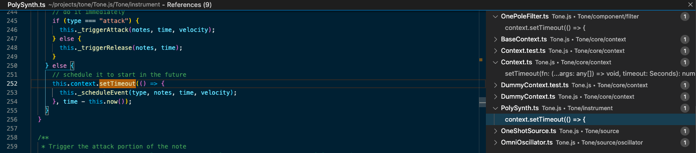

# tone-learn

This repo serves as a documentation of me learning Tone.js. My goal of learning is to understand the design, the architecture, and the implementation of Tone.js as a whole piece. It's based on [Tone.js v14.7.17](https://tonejs.github.io/docs/14.7.77/index.html).

# Start It From the Ground

Tone.js uses [`standardized-audio-context`](https://github.com/chrisguttandin/standardized-audio-context) to replace to the native [`AudioContext`](https://developer.mozilla.org/en-US/docs/Web/API/AudioContext). It helps Tone.js abstracts away from browser imeplementations of Web Audio API. In my opinion, the most important contribution of Tone.js is the timekeeper class `Transport`.

```
Tone
├── component/
├── core/
├── effect/
├── event/
├── instrument/
├── signal/
├── source/
├── classes.ts
├── fromContext.test.ts
├── fromContext.ts
├── index.test.ts
├── index.ts
└── version.ts
```

Above is the source code directory of Tone.js, `Tone/`. Let's go straight into the entry point `Tone/index.ts`.

The first thing I noticed is that it imports and exports the `getContext` and `setContext` from `Tone/core/Global.ts`:

```typescript
// Tone/index.ts

export { getContext, setContext } from "./core/Global";
```

This method is written based on the assumption that we have only one global audio context. The context is the main access point to the Web Audio API, so almost everything in Tone.js is related to this object. But, how is this global context created? There are several files in `Tone/core/context/` related to the abstractions over the `standardized-audio-context`, including...

1. `AudioContext.ts`,
2.  `BaseContext.ts`,
3.  `Context.ts`,
4.  `OfflineContext.ts`, and
5.  `DumyContext.ts`.

`AudioContext.ts` is the contact point to the `standardized-audio-context`. It provides the methods create 2 different kinds of audio contexts, the regular one and the [offline one](https://developer.mozilla.org/en-US/docs/Web/API/OfflineAudioContext). The offline context only renders audio signal as fast as possible to an `AudioBuffer` in the memory instead of to the speaker. It could be used for analysis, testing, and save audio data without worrying about real-time audio rendering.
Native Web Audio API includes a class `BaseAudioContext` as the base class of this 2 kinds of contexts. The file `BaseContext.ts` is the Tone.js version of it. It extends the Tone's `Emitter` instead of the native [`EventTarget`](https://developer.mozilla.org/en-US/docs/Web/API/EventTarget)and it removes some unused or deprecated methods.

```typescript
// Tone/core/context/BaseContext.ts

export type ExcludedFromBaseAudioContext =
	| "onstatechange"
	| "addEventListener"
	| "removeEventListener"
	| "listener"
	| "dispatchEvent"
	| "audioWorklet"
	| "destination"
	| "createScriptProcessor";

export type BaseAudioContextSubset = Omit<
BaseAudioContext,
ExcludedFromBaseAudioContext
>;

export abstract class BaseContext
	extends Emitter<"statechange" | "tick">
	implements BaseAudioContextSubset {
    ...
}
```

`Context.ts` is the meat of the Tone's context implementation. I want to use the next section to cover it. It extends `BaseContext` and implements most of the methods of native audio context. Besides, it also includes some important member variables, such as `transport`, `destination`, `_ticker`,  `draw`, and `lookAhead`. 

`OfflineContext.ts` is the offline context implementation of Tone.js. One interesting thing is that it inherit the class [`Tone.Context`](https://tonejs.github.io/docs/14.7.77/Context) rathe than `BaseContext`. It's a little bit different from the native Web Audio API. I am not sure about the reason, but I guess it's just convenient. Tone also provides an [`Offline`](https://tonejs.github.io/docs/14.7.77/fn/Offline) API for using `OfflineContext`. You can checkout the document page to see how to use it. One interesting thing to notice is how `OfflineContext` render: it needs to call the native API  `startRendering` along with `_renderClock` because there are events bind to the "clock" of the `Context` assigned by Tone.js. Inside, `_renderClock`, the following line is how to manually move the clock of `Context` forward:

```typescript
// Tone/core/context/OfflineContext.ts

// invoke all the callbacks on that time
this.emit("tick");
```

I will discuss about the mechanism behind `emit` in the next part.

`DumyContext.ts` is used in the `Tone/core/Global.ts` for preventing errors from Node when importing Tone.js. It's just a class extending `BaseContext` and implement the methods with no-op functions. As far as I know, Tone.js doesn't work on Node.js at this moment, but who knows what will happen. 

# Context

Why do I want to start from `Context`? Isn't it just a wrapper around the native API? It's not.

 `Tone.Transport` is the main timekeeper as the wiki says, but we can still trigger and schedule future triggers oscillators and synthesizers in Tone.js without starting `Transport`. It's just calling directly to the native API and schedule it precisely. A lot of the features of `Transport` are implemented in the code of `Context`, such as the `_ticker` in `Context`.

We mentioned all the Tone.js codes share a single `Context`. Where is it created? It's in the function `getContext` in `Global.ts` and it will be called on line 33 in `Tone/index.ts`.

## Initialization

Where are the `Tone.Transport` and the `Tone.destination` of the `Tone.context` created? They are both created in the initialization process of the `Tone.context`. By the way, the capitalization of the three objects are not typos, it was a weird convention of Tone.js. 

This file `Tone/core/context/ContextInitialization.ts` is included in `Context.ts` and called in the private method `initialize`. It provides functions and variables in order to aggregating all the necessary callbacks to create and closed a context. The reason why they are not created in the constructor is that not every context needs these objects, such as `OfflineContext`. There are totally four different member variables are initilized by this mechanism:

1. `context.transport`
2. `context.destination`
3. `context.listener`
4. `context.draw`

You can find all of them by searching `onContextInit` in the source code directory. Also, all these objects are exposed in the core functions: `Tone.getContext`, `Tone.getDestination`, `Tone.getDraw`, `Tone.getListener`, and `Tone.getTransport`.

## Ticker

At the beginning, I thought `Context` provides a almost transparent layer to the native context. In terms of time keeping, the native API only provides 2 main functionality, current time ([BaseAudioContext.currentTime](https://developer.mozilla.org/en-US/docs/Web/API/BaseAudioContext/currentTime)) and schedule value changes ([AudioParam.setValueAtTime](https://developer.mozilla.org/en-US/docs/Web/API/AudioParam/setValueAtTime)). In Tone.js, `Context` support a mechanism "tick" with the class `Ticker`.

`Ticker` invoke callback regularly with either `Web Worker` or `setTimeout`, just like a ticking clock. You can specify the type by passing in `type: TickerClockSource` to the `Ticker` constructor. The other options is to pass `offline` as the `type` to prevent creating any clock mechanism. `Ticker` will fire the passed in from `Context` which is the emission of "tick" event repeatedly.

The reason why we can hook and emit custom events on `Context` is that it inherit `BaseContext` which inherit `Emitter`.

```typescript
// Tone/core/context/Context.ts

this._ticker = new Ticker(
  this.emit.bind(this, "tick"),
  options.clockSource,
  options.updateInterval
);

// Tone/core/clock/Ticker.ts

// 1. worker
worker.onmessage = this._callback.bind(this);

// 2. setTimeout
this._timeout = setTimeout(() => {
  this._createTimeout();
  this._callback();
}, this._updateInterval * 1000);
```

`Context` implements its own `BaseContext.setInterval` using the "tick". It's used as a replacement for the native `setInterval` in Tone.js because we can manage the scheduling can canceling as we want instead of letting the browser take care of it. Also, it's nice to have a single pool for the upcoming events in the context, and it's stored in the variable `_timeouts` and call every tick in `_timeoutLoop` by binding it to the "tick" event!

What's the precision of the "tick"? It's basically based on `setTimeout`, so it's not sample accurate. So we usually using this to schedule callbacks before the real timing of some sound changes and schedule a sample-accurate precise event in it. It's not used heavily in Tone.js, but below is one example of using it to schedule attack or release for `PolySynth`. It's used here to manage the multiple voices, so it's not used in  `Monophonic` instruments.



Furthermore, "tick" event binds with another callback, which is binded from the `Clock` object in `Tone.Transport`. We will talk about it later.

## Look Ahead

Native `AudioContext` has an option [AudioContextOptions.latencyHint](https://developer.mozilla.org/en-US/docs/Web/API/AudioContextOptions/latencyHint) to tell browser how much real-timen the application requires. Tone.js only set it in the beginning and never change it even we call `_setLatencyHint`. What Tone.js does is use `lookAhead` to adjust the amount of real-time quality. This real-time quality refer to how much time to look ahead when scheduling precise events. If we look ahead too far, we will miss the potential cancelling before it really happen, such as changing patterns rapidly in a drum sequencer. If we look ahead too shortly, the chance of delay increases because of the unpredictable JavaScript runtime. Please read about this tradeoff in ["A Tale of Two Clocks - Scheduling Web Audio with Precision"](https://www.html5rocks.com/en/tutorials/audio/scheduling/).

The design of the variable `lookAhead` leads to two different ways to lookup time in Tone.js:

1. `now`
2. `immediate`

```typescript
// Tone/core/context/Context.ts

now(): Seconds {
  return this._context.currentTime + this.lookAhead;
}

immediate(): Seconds {
  return this._context.currentTime;
}
```

# Transport

The meaning of `Transport` could be easily thought as the timeline manipulation in a traditional DAW interface, where you can start/pause/stop, traverse in time, loop certain parts, automate BPM, and etc. `_processTick()` is the entry point of all power of `Transport`. It handles the most important features of a Tone.js Transport:

1. Loop
2. Swing
3. Invoke scheduled events

You can see that literally in the comment in the function implementation. Where is this callback called? It's called by the created `Clock` object which invokes `_processTick()` on "every tick". This is totally different from the "tick" I mentioned in `Context` part. I will later called the tick from `Context` as "context tick". Look at the line 97 in `Clock.ts`:

```javascript
this.context.on("tick", this._boundLoop);
```

`Clock` bind the function `this._boundLoop` to the `Context` event "context tick" to invoke it on every "context tick", and it calls the `_processTick()` from `Transport` in it. The way it's called is interesting:

```javascript
// Tone/core/clock/Clock.ts

this._tickSource.forEachTickBetween(startTime, endTime, (time, ticks) => {
	this.callback(time, ticks);
});
```

The "context tick" is a not so precise clock, and the tick provided by the `_tickSource` is the sample accurate clock. Therefore, we use the context tick to trigger the `_loop` or `_boundLoop` regularly, and call a series of "ticks" with the callback. Note that, the time when the "tick" callback happen is not accurate either, but it provides the accurate time as a parameter so we can use it to schedule sample-rate accurate audio events.

## TickSource, TickSignal, and TickParam

In the beginnning, I didn't understand why Tone.js has to build this multilayer abstraction on the "tick", "clock", and "beats". I only realized the motivation behind this after I read about the [BPM automation paper](https://smartech.gatech.edu/bitstream/handle/1853/54588/WAC2016-49.pdf) which is shout out in the source code. To my understanding, "tick" provided by `TickSource` is the ground truth of time in the design of Tone.js. Every kind of notation for time in Tone.js will be transformed to tick everntually. The "tick" is calculated mostly in `TickSource` fucntion `getTicksAtTime`. Everytime you want to get the current tick, you will have to count it from the last "stop" event to the "current time". The adding up needs to consider the "pause" by omitting the ticks when paused or tick offsets created when the tick is set by the `setTicksAtTime`.

The adding is still not trivial. It has to call `getTicksAtTime` of `this.frequency` which is a `TickSignal`. `TickSignal` extends `Tone.Signal` so it's like a wrapper around an audio-rate "number". In this case, the "number" is the "tick signal". Underlying the signal, it's the `Param` (`TickParam` in this case) which is a thin wrapper around native `AudioParam`.

The implemntation details of `Clock`,  `TickSource`, `TickSignal`, and `TickParam` are quite complicated. `TickParam` tracks the ticks not matter the status of the Transport ("start", "stop", or "pause"). The `_param` in it is exactly the `Transport.bpm`. `TickParam` is fully aware of the value changing events scheduled on the tempo (BPM) but it doesn't know anything about the `Transport` status. `TickSource` is the class that takes care of how ticks count should be modified when the `Transport` is either "start", "stop", or "pause".

## Scheduling

We now know that `Transport` keeps invoking scheduled events in the "tick loop" and how the tick is generated and tracked, the next intuitive question would be "how do you schedule new events"? There are three methods for scheduling and the names are direct:

1. `schedule`,
2. `scheduleOnce`, and
3. `scheduleRepeat`

All of the events are stored as a object of `TransportEvents` in `_timeline`, which is class `Timeline` and it supports fast retrieval of stored contents with binary search. Besides from `_timeline`, all the scheduled events are also stored in a ID mapped hash map `_scheduledEvents`. It could be found in the function `_addEvent` which is called by every scheduling methods. **Therefore, the fastest way to lookup all the events of `Transport` is to inspect the object `_scheduledEvents`.** All the scheuled events will be invoked right in the `_processTick` which is called every tick.

# Tone.Signal

The official wiki has explained a lot about what `Tone.Signal` is for Tone.js, but I want to mention here some of the things I realized through reading the code. `Tone.Singal` includes a constant source node as the signal data. It could be treated as a node in Tone.js so it could be connected to other signals or sent to destinations. It is just a "audio-rate number" which could be scheduled to change, nothing too complicated.

# Future Topics

- Events and `ToneEvent`
- Component
- Instrument
- Effects
- Play with microphone inputs
- Unit


